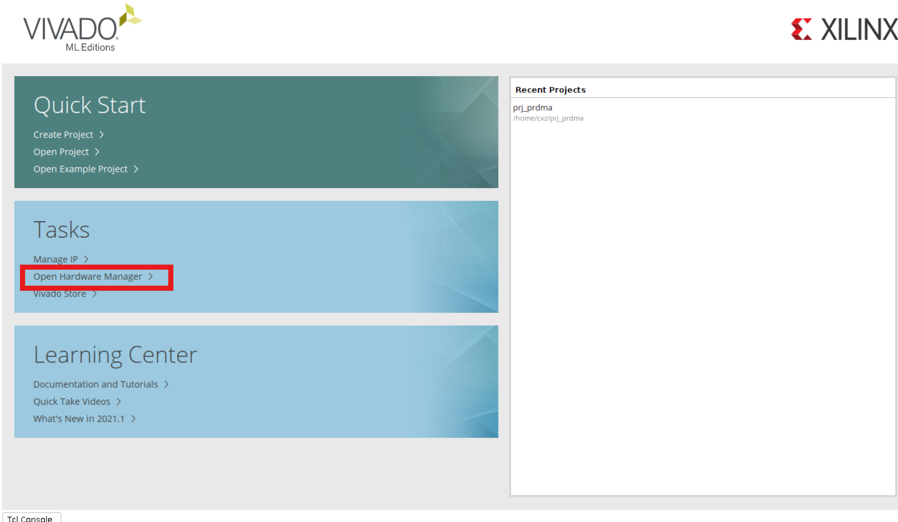
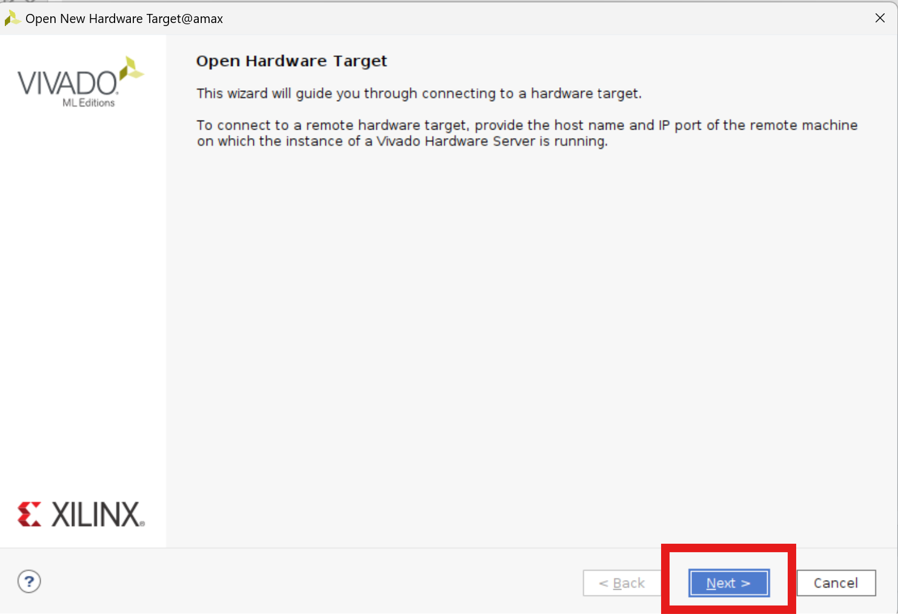
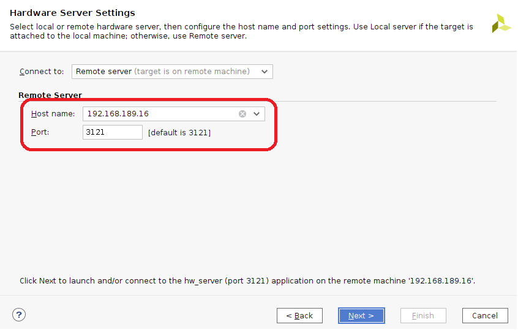
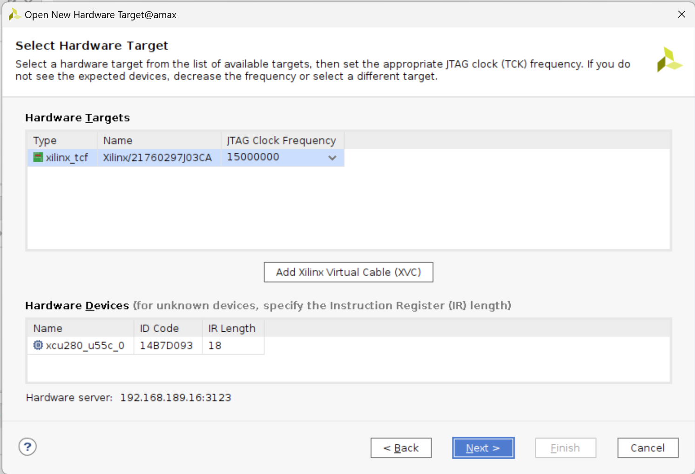
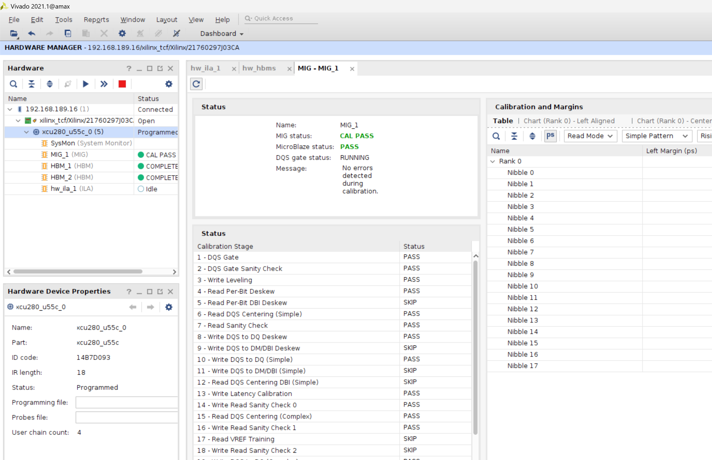
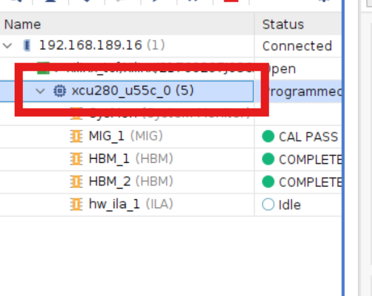
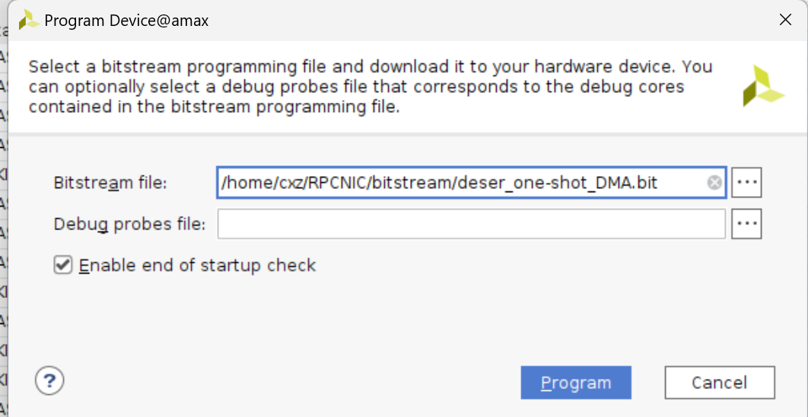

# Connect and Deploy Bitstream

We provide three machines for artifact evaluation: a **sender**, a **receiver**, and a **Vivado machine**. Both the **sender** and the **receiver** are equiped with a Xilinx U280 FPGA and a ConnectX-5 NIC machine. The **sender** and the **receiver** are used for the experiment, and the **Vivado machine** is used for deploying bitstream.

## 1. Connect to Artifact Machine
We already create a sudo user `atc25` on three machines, but disable password login for security reasons. You can use the following command to connect to the artifact machine.

1. Download private key `atc25_id_ed25519` from the submit website.
2. Get the jump server domain name (use `jump` refer as following) from the submit website, we provide IPV4 server and IPV6 server(recommend).
3. `ssh atc25@js.v4.rc4ml.org -p xxx -i atc25_id_ed25519`
4. Enjoy for testing
5. If you have any questions, please contact us.

## 2. Deploy Bitstream on FPGA

### 2.1 Open Vivado

We already install vivado21 on **Vivado machine**, you should connect to the Vivado machine **by a terminal support X11 forward(important!!)** and open Vivado by typing `vivado` in the terminal. We recommend using **MobaXterm** to connect to the Vivado machine.

### 2.2 Open Hardware Manager

Click `Open Hardware Manager` to open the hardware manager.

### 2.3 Open Target 

First click `Open Target` to open the target, and then click `Open New Target` to open the new target.

Click `Next` to continue.

Type in `192.168.189.16` and `3123` for `Remote server`, and click `Next`.

Then check the name and the type of hardware target, and click `Next`.

Finally we connect to the FPGA.

### 2.4 Program FPGA

Choose U280 with the ID **21770205K02VA**
Right click the FPGA name `xcu280_u55c_0` and click `Program Device`.

Then choose the bitstream file `bitstream/xxxxx.bit` and click `Program`. You don't need set `Debug probes file`.

After the bitstream has been successfully programmed. Choose U280 with the ID **21760297J03CA**
Right click the FPGA name `xcu280_u55c_0` and click `Program Device`.

Then choose the bitstream file `bitstream/xxxxx.bit` and click `Program`. You don't need set `Debug probes file`.

### 2.5 Restart sender and recerver machine

After programming the FPGA, you should restart the sender and receiver by typing `sudo reboot` in the terminal. And then you can run the SwRDMA experiment.